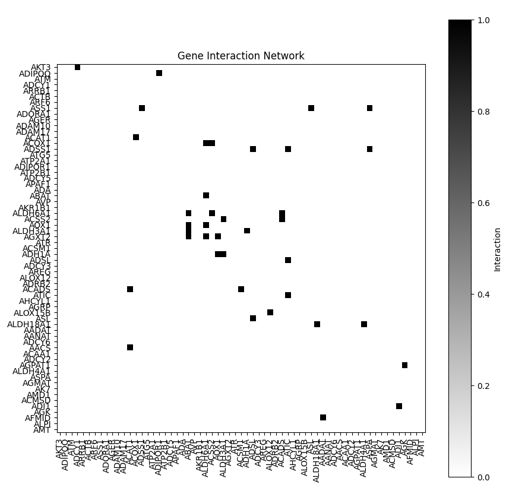

# PathwayOracle

PathwayOracle is a tool that takes advantage of AI reasoning and inference capabilities to interpret the results of traditional Pathway Analysis worflows and predict pathway systems significance towards the subject disease state. 

In essence this tool converts Pathway Analysis into a constraint network Subgraph problem that is maintained through a knowledge graph database. Various manipulations internally and externally handle token size limitations providing relevant summaries through an RAG approach along with clinically relevant evaluations based on the LLM's pretrained corpus.

To quickly detail the steps:
1. **Pathway Analysis:** Pathway analysis using netGSA is performed
2. **Marking Results:** Results are marked in Neo4j knowledge graph database created from KEGG, GO, and UniProt resources.
3. **Graph Datascience Grouping:** Weakly connected components are calculated from the marked knowledge graph forming interaction constrained components.
4. **Network dynamic Text scoring:** Vector-based cosine similarity scoring of gene text embeddings are compared with marked genes in direct interactions, maintaining only network relevant text chunks.
5. **RAG-KG-Subgraph Descretization:** Retrieval of relevant information through descretized grouped documents.
6. **LLM Summarization:** Large components are further broken down, small components are directly fed into the LLM using Map-Reduce abstractive summarization:
    - For Large Components:
        - Ontological clustering of large components using TfIdfVectorizer and HDBSCAN
        - Cluster_patch method, recovering noise points using a network interaction matrix.
7. **Document Creation:** Summaries are parsed and titled based on implication score.

## Demo Result
<sup><sub></sub></sup>
#### Component: 0 Cluster: 5
#### Genes Involved: ACAT1 ACOX1 ACSS2 ADH1A ACADS ACSM1 AACS ALOX12

#### Pathways Involved:
<sup><sub>
- Metabolism-Carbohydrate metabolism-Glycolysis - Gluconeogenesis
- Metabolism-Carbohydrate metabolism-Propanoate metabolism
- Organismal Systems-Nervous system-Serotonergic synapse
- Metabolism-Xenobiotics biodegradation and metabolism-Drug metabolism - cytochrome P450
- Metabolism-Metabolism of cofactors and vitamins-Retinol metabolism
- Metabolism-Carbohydrate metabolism-Butanoate metabolism
- Metabolism-Amino acid metabolism-Valine, leucine and isoleucine degradation
- Metabolism-Lipid metabolism-Fatty acid degradation
- Metabolism-Lipid metabolism-Arachidonic acid metabolism
- Metabolism-Metabolism of cofactors and vitamins-Lipoic acid metabolism
</sub></sup>

#### Interactions Involved:
<sup><sub> 
- 'ACAT1', 'compound_', 'ACOX1', 'Metabolism-Lipid metabolism-Fatty acid degradation'
- 'ACOX1', 'compound_', 'ACSS2', 'Metabolism-Carbohydrate metabolism-Propanoate metabolism'
- 'ACSS2', 'compound_', 'ACADS', 'Metabolism-Carbohydrate metabolism-Propanoate metabolism'
- 'ACADS', 'compound_', 'ACSM1', 'Metabolism-Carbohydrate metabolism-Butanoate metabolism' 
- 'ACADS', 'compound_', 'ACAT1', 'Metabolism-Lipid metabolism-Fatty acid degradation' 
- 'AACS', 'compound_', 'ACAT1', 'Metabolism-Amino acid metabolism-Valine, leucine and isoleucine degradation'
- 'AACS', 'compound_', 'ACAT1', 'Metabolism-Carbohydrate metabolism-Butanoate metabolism'
<sup><sub> 

```diff
The gene entities ACAT1, ACOX1, ACSS2, ADH1A, ACADS, ACSM1, AACS, and ALOX12 play crucial roles in various metabolic processes related to fatty acid metabolism, lipid oxidation, and energy production.

ACAT1 is involved in the breakdown of fatty acids into acetyl-CoA, essential for ketone body metabolism. It interacts with ACOX1 in lipid metabolism pathways, highlighting their collaboration in fatty acid degradation. ACAT1 is moderately positively expressed, indicating its active involvement in cellular functions related to fatty acid metabolism.

ACOX1 catalyzes the desaturation of fatty acyl-CoAs and plays a central role in fatty acid oxidation and energy generation. It interacts with ACSS2 and ALDH6A1 in carbohydrate metabolism pathways, emphasizing its significance in metabolic processes. ACOX1 has a high expression level, further supporting its crucial role in energy production mechanisms.

ACSS2 regulates genes associated with autophagy and lysosomal activity in brain tumorigenesis, promoting tumor cell survival. It interacts with ACADS and ALDH3A1 in carbohydrate metabolism pathways, contributing to energy production processes. ACSS2 is moderately positively expressed and plays a key role in promoting tumor cell survival through autophagy regulation.

ADH1A is involved in alcohol and retinol metabolic processes, interacting with ALDH3A1 and AOX1 in drug metabolism pathways. It has a moderate positive expression level and is crucial in the metabolism of alcohol and retinol.

ACADS is crucial in the first step of mitochondrial fatty acid beta-oxidation, interacting with ACSM1 in carbohydrate metabolism and with ACAT1 in lipid metabolism. It is moderately positively expressed and plays a significant role in energy production from fats.

ACSM1 activates fatty acids in the first step of fatty acid metabolism, interacting with various gene entities in metabolic pathways. It is strongly expressed and plays a crucial role in fatty acid metabolism and xenobiotic metabolism.

AACS is involved in cholesterol and fatty acid synthesis, interacting with ACAT1 in metabolic pathways. It plays a role in insulin secretion and fatty acid metabolic processes, with a moderate positive expression level.

ALOX12 is crucial in the metabolism of lipid compounds, producing specialized mediators that regulate immune responses and platelet aggregation. It interacts with lipid metabolism pathways and is moderately positively expressed.

In terms of breast cancer implication, ACAT1, ACOX1, ACSS2, ACADS, and AACS have been implicated in breast cancer progression and metabolism. ACAT1 and ACOX1 have been associated with lipid metabolism alterations in breast cancer cells, while ACSS2 has been linked to promoting tumor cell survival. ACADS and AACS play roles in fatty acid metabolism, which can impact breast cancer development.

Implication (ACAT1, ACOX1, ACSS2, ACADS, AACS in Breast Cancer): 7/10
Certainty (ACAT1, ACOX1, ACSS2, ACADS, AACS): 8/10
```
 


## Installation

```python
pip install PathwayOracle
```

## Usage/Example

### User defined values
```python
from PathwayOracle import PA_WorkFlow
from PathwayOracle import LLM_Summ
import os
from dotenv import load_dotenv

load_dotenv()

openAIKey = os.getenv("OPENAIKEY")

subjectType = 'breast cancer'

```
Setting all user defined variables to run the project, it requires an OpenAI key and a succinct string describing the topic the dataset explores.

### Conducting netGSA analysis and marks Knowledge Graph.
```python 
# creating an object that will handle writing pathway analysis results to a KG-database 
kg_Work = PA_WorkFlow.PA_KG(pathGene='./geneExpression_data.txt',pathGroup='./group_data.txt', subject=subjectType)

# retrieves the exp_id used inside the database if user wants to visualize the resultant subgraphs in Neo4j
exp_id = kg_Work.expID_retrieve()

# conducts pathwayAnalysis worflow using netGSA package
kg_Work.pathwayAnalysis()

# writes netGSA results into graph database, conducts graph datascience analysis, KG-text scoring, and cleanup.
kg_Work.kgSubgraph()
```
The gene expression dataset file format must follow a tab delimited file, with sample ids as columns, and entrezIds as rows. EntrezIds must be in the format "ENTREZID:ENTREZ_NUMVALUE". For example, "ENTREZID:222". Gene expression values must be log transformed values.

The group data file is a simple text file that is a vector mapping columns of x to conditions. 1 corresponding to the positive class and 2 corresponding to the negative class. 

As seen above the steps constitute network pathway analysis using netGSA (currently only tool supported). Output files will be written to the directory in which this analysis takes place, then the results of this analysis is used to mark the KG database with the user's data. This mark is retained in the graph database and will be used for future analysis.

### WCC Analysis: Interaction constricted components.
The following is an example of the result of WCC analysis on the PA results:

| Components | Gene Count | Pathway Count |
| -------- | -------- | -------- |
| 0    | 74     | 118     |
| 23    | 3     | 1     |
| 63    | 3     | 1     |
| 83    | 1     | 1     |
| 108    | 1     | 1     |
| 116    | 1     | 1     |
| 117    | 1     | 1     |
| 118    | 2     | 1     |
| 119    | 8     | 1     |
| 125    | 2     | 1     |
| 129    | 1     | 1     |

Most of these components can be fed directly into the LLM for summarization, however the large component 0 needs to be digested in several groups to fit token limit sizes. Large Components are grouped into ontologically similar clusters using TfIDFVectorizer and HDBSCAN clustering. 

After HDBSCAN clustering, noise points are recovered using an interaction matrix and populated in clusters where directly interacting genes exist. This process is called a cluster patch and aims to improve the recall of an ontologically similar cluster.

Here is one resultant interaction network visualization that is outputted during the analysis:



<p style="color:red">Save and close the image in your analysis to continue</p>


### RAG-LLM Summ: Descretizing information into documents and conducting abstractive summarization
```python
# retrieves knowledge graph data from graph database
retrievedDocuments = kg_Work.retrieval()

#creating a summary object
allSumm = LLM_Summ.LLM_Summ(retrievedDocuments, subjectType)

# connects ChatGPT OpenAI of your choosing using key. You can try GPT-4.0 for more elaborate descriptions.
allSumm.llm_connect(key=openAIKey, opt="gpt-3.5-turbo")

# generates summaries, if component is too large uses ontology and interactions to group data into clusters.
# if to_write option is enabled then the data output is written to files in current working directory
rankedSummaries = allSumm.generateSumm(to_write=True)

print(rankedSummaries)
```
The to_write file option is heavily recommended, as it parses maximum implication scores of each summary and labels it in the file header.

If you are interested in the map and reduce template prompts you can take a look at that using:
```python
# retrieves knowledge graph data from graph database
allSumm.map_prompt
allSumm.reduce_prompt
```