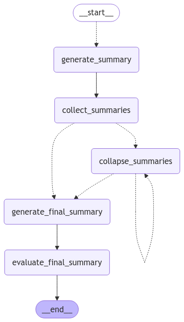
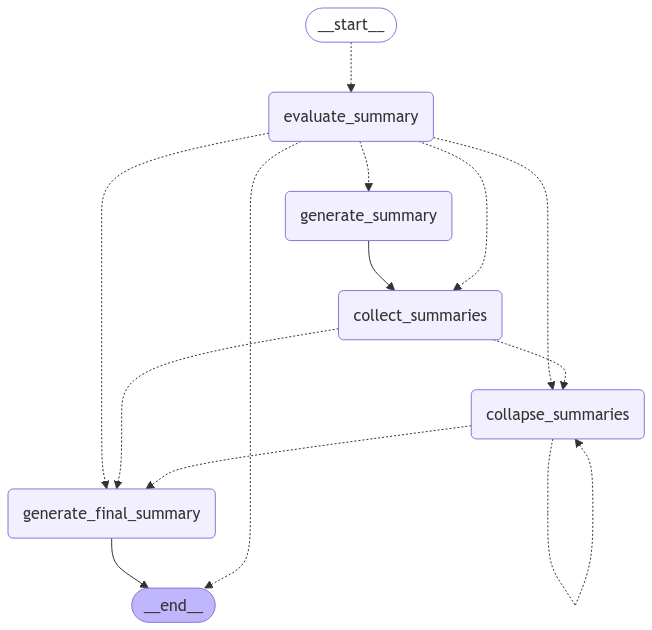

# PathwayOracle

#### *PathwayOracle is a tool that takes advantage of AI reasoning and inference capabilities to interpret the results of traditional Pathway Analysis and Variant Analysis worflows and predict gene-level significance towards the subject disease state.*

Current 2nd generation translative bioinformatics tools rely on <u> Pathway level justifications </u> for perturbed genes. This ends up in a discretized system of analysis without digestible insight on <u> highly suspect molecular mechanisms occuring at the gene-level</u>. Furthermore, the detection rate of perturbed genes that are insignificant can still get picked up in the current generation of pathway analysis tools.

PathwayOracle builds on the results of current translative bioinformatics tools while applying AI reasoning capabilities to provide gene-system-wide descriptions of perturbed pathways that is highly scalable with highthroughput analysis. It relies on a plethora of structured databases to provide justifications for the significance of genes in an underlying process.

## Installation

```python
pip install PathwayOracle
```
## How it works:

1. The tool relies on a knowledge graph built in <strong>Neo4j</strong> with structured data for all genes, including an ontology semantic layer from <strong>GO</strong>, pathway data between genes from <strong>KEGG</strong>, function data from <strong>UniProt</strong> function annotations, and <strong>PubMed</strong> publications with tandem BioBert embeddings. 

2. In the retrieval phase the tool relies on graph datascience approaches, utilizing weakly connected components to identify gene systems. It also relies on an Agentic tool with a reasoning engine, that retrieves <u> subject relevant </u> data *(user defined description of analysis)*, utilizing a hybrid search event. 
3. Langgraph defined Map-Reduce summarization and evaluation occurs to produce <u> connected, comprehensive, and relevant descriptions</u> of suspect genes.

## Basic Usage

### User defined values
```python
import os
from dotenv import load_dotenv

load_dotenv()

openAIKey = os.getenv("OPENAI_API_KEY")

```
Setting all user defined variables to run the project, it requires an OpenAI key which you should define in your environment (.env) file.

### Conducting Pathway analysis.
```python 
# Utilizing automated Pathway Analysis script
from PathwayOracle.PathwayAnalysis.PA_Analyzer import PA_Analysis

# checks that the files exist
PA = PA_Analysis(pathGene='./testDataFiles/data_Matrix_Ductal_Age.txt',
            pathGroup='./testDataFiles/group_ductal_age_data.txt', 
            write_to = './testDataFiles/')

# This will generate pathway network analysis results using netGSA and construct files for visualization in D3.js 
PA.pathwayAnalysis()
```
### Connecting to Azure-hosted KG Database

After the user has the primary data files for marking the KG-database, they can create a KG-Interface object through the PA_KG class.

```python
>>> from PathwayOracle.KGInstance.PA_KG import PA_KG

# Here we specify details to gain access to our user KG node and add to it a subject descriptors (retained amongst other descriptors)
>>> kgWork = PA_KG(email="throw_awayEmail@gmail.com", user="yoyo458", subject="age-effect in lobular breast cancer")


Output:
Attempting connection with LLM ChatOpenAi
Connection successful
VM Response Status: Virtual machine [neo4j-onco-vm] status: VM running. No action performed as the request was for status.
Found User
[{'instances': [{'instance_id': 'yoyo458_441', 'subject': 'non-small_cell_lung_cancer'}]}]
```
Here we specify our credentials to gain access to our previously processed data as seen by instance ' *yoyo458_441* ' which was analysis studying non-small cell lung cancer. Email verification is not processed, so you can use whatever string you like for your email, just try to remember it.

We also mark on our User that we will be conducting an analysis studying gene expression differences in patients with lobular breast cancer but specifically with different age-of-onset cohorts.

### Instance-based Marking/Retrieval

```python
>>> kgWork.newInstance()

Use this instance_id to retrieve data after analysis. InstanceId: yoyo458_241 

# This is a quickfire method that marks, processes, and retrieves data through an Agentic approach
>>> kgWork.processAll(geneFile= './testDataFiles/gene_results.csv',
                 pathFile='./testDataFiles/pathway_results.csv')
```

### Lang-Graph Summarization and evaluation

Now that our KG has been marked, WCC analysis has organized genes into systems based on their interacting significant neighbors, and retrieval has occured using an Agentic approach.

You can see that our data per gene is organized, but a holistic summary is not yet formed.

We can do holistic summarization and evaluation of the significance of the content using Langgraph summarization:
```python
# This will generate output for all genes and all components and subcomponents.
>>> retDocs = await kgWork.generateSummaries(to_write=True, folder_name = 'SummaryFiles_Complex')

Working on component key: 0, subcomponent key: 21
ASNS ASS1 ADSL ASPA ASL ADSS1 ATIC AMPD1
['generate_summary']
['generate_summary']
['generate_summary']
['generate_summary']
['generate_summary']
['generate_summary']
['generate_summary']
['generate_summary']
['collect_summaries']
['collapse_summaries']
['collapse_summaries']
['generate_final_summary']
Significant:  retain
['evaluate_final_summary']
Writing txt files to directory ./SummaryFiles_Complex
```
This will generate summaries on all components. Look at the Advanced Examples Guide / Supporting Information for generating component specific responses.


## Demo Result

#### Component: 0 
#### SubCluster: 0

#### Genes Involved: AMPH

#### Summary:
The gene AMPH (amphiphysin) is significantly implicated in the context of age-related effects in lobular breast cancer due to its involvement in critical cellular processes relevant to cancer biology. AMPH is known to play a role in the regulation of the membrane-associated cytoskeleton and is involved in mechanisms of regulated exocytosis, particularly in synapses and certain endocrine cells. This suggests that AMPH may interact with other proteins that are part of these processes, although specific interacting genes are not detailed in the provided information.

Several publications highlight the connection between AMPH and breast cancer, particularly in relation to autoimmunity. For instance, the study titled "Expression of amphiphysin I, an autoantigen of paraneoplastic neurological syndromes, in breast cancer" (PMID: 9513187) indicates that AMPH is expressed in breast cancer tissues, suggesting a potential role in tumor biology. Additionally, the research "Autoimmunity in stiff-Man syndrome with breast cancer is targeted to the C-terminal region of human amphiphysin" (PMID: 8076697) points to the autoimmune responses associated with AMPH in patients with breast cancer, further linking the gene to the disease.

The expression value for AMPH is notably high at **18.3308072337505**, indicating a significant level of expression that may be relevant in the context of lobular breast cancer. This elevated expression, combined with its functional roles in immune responses and cellular transport mechanisms, underscores the potential influence of age on the gene's activity and its implications for lobular breast cancer. Overall, the evidence suggests that AMPH is a critical gene in understanding the mechanisms underlying age-related effects in this type of cancer.

------------------------------
#### Component: 0
#### SubCluster: 21

#### Genes Involved: ASNS ASS1 ADSL ASPA ASL ADSS1 ATIC AMPD1

#### Summary:
The gene ASNS (Asparagine Synthetase) is significantly implicated in lobular breast cancer due to its crucial role in amino acid metabolism, particularly in the biosynthesis of asparagine, which is vital for various cellular processes. ASNS interacts with other relevant genes such as ADSS1, ASS1, and ASPA, forming a network that may influence cancer progression and treatment responses. Notably, a study (PMID: 17088436) found a negative correlation between ASNS expression and sensitivity to L-asparaginase in ovarian cancer, suggesting that higher ASNS levels could confer resistance to treatment. This positions ASNS as a potential predictive biomarker for therapeutic responses in cancers, including lobular breast cancer. Additionally, research (PMID: 18852115) indicates that ASNS expression enhances the survival of pancreatic cancer cells under glucose deprivation, hinting at a protective mechanism that may also be relevant in lobular breast cancer.

Another gene of interest is ADSS1 (Adenylosuccinate Synthase 1), which plays a significant role in nucleotide metabolism, particularly within the purine nucleotide cycle. ADSS1 catalyzes the first committed step in the biosynthesis of AMP from IMP, essential for maintaining nucleotide levels necessary for cellular functions. Its expression level of 27.2329 indicates substantial activity, suggesting its relevance in metabolic processes that may influence cancer development and progression. ADSS1 interacts with several other genes involved in metabolic pathways, including ASNS, ASS1, and AMPD1, forming a network that collectively contributes to metabolic regulation. A publication (PMID: 15786719) highlights the importance of ADSS1 in muscle metabolism and AMP synthesis, suggesting that its metabolic influence could play a role in cancer progression as individuals age.

While ASS1 (Argininosuccinate synthase 1) is also involved in amino acid metabolism, particularly in the urea cycle, it does not have a direct link to lobular breast cancer or age-related effects, making ASNS and ADSS1 the more relevant genes in this context. Other genes like ASPA and ASL, despite their involvement in metabolic processes, lack substantial evidence connecting them to lobular breast cancer, further emphasizing the significance of ASNS and ADSS1 in understanding the implications of amino acid and nucleotide metabolism in this cancer type.

## Advanced Examples / Supporting Information

### NetGSA automated Pathway Analysis Data File Format:

The gene expression dataset file format must follow a tab delimited file, with sample ids as columns, and entrezIds as rows. Gene expression values must be log transformed values.

The group data file is a simple text file that is a vector mapping columns of x to conditions. 

```python
gene_path="./testDataFiles/data_Matrix_Ductal_Age.txt"

                 TCGA.A1.A0SD.01  TCGA.A1.A0SF.01  TCGA.A1.A0SI.01  \
ENTREZID:10357          5.913201         7.141528         5.989800   
ENTREZID:10431          9.933569        10.252269         9.778346   
ENTREZID:155060         6.387132         8.296679         7.226836   
ENTREZID:57714         10.067252         7.959437        10.137689   
ENTREZID:653553         7.826203         8.110198         7.996865 

group_path="./testDataFiles/group_ductal_age_data.txt"

     x
1    1
2    1
..  ..
247  2
248  2
```

So far only netGSA Network-based Pathway Enrichment analysis is utilized, but I will go over the file formats used to mark the KG-database as well.


### Note when specifying descriptors:

Descriptors are used for hybrid search and to put in context to the LLM what the data is coming from. Choosing an adequate descriptor phrase is paramount for having relevant results.

<strong>Tips:</strong>
- Describe what you are analyzing
- Use short phrases
- Use common words
- Make sure to specify the sample context (disease-state)

#### *Think of this like a search key-term phrase:*


### In case you want to use another pathway analysis tool:

#### Input Data Format:
```python
>>> df = pd.read_csv('./testDataFiles/gene_results.csv', delimiter=',')

    teststat   gene      pFdr
0  18.330807   AMPH  0.023285
1  15.357190  LAMA1  0.075658
2  34.795558   AREG  0.000032
3  14.655446  NTRK3  0.085921
4  20.173237   IL20  0.014275

>>> df = pd.read_csv('./testDataFiles/pathway_results.csv', delimiter=',')

                                               pathway  pSize           pFdr  teststat
0    Organismal Systems-Endocrine system-Prolactin ...     21   0.000000e+00   -44.959874
1    Human Diseases-Infectious disease- viral-Hepat...     37  1.837184e-280   -38.272176
2    Organismal Systems-Immune system-Platelet acti...     20  6.831119e-241   35.180556
3    Cellular Processes-Transport and catabolism-Ph...      7  3.296398e-232   -34.381875
4    Organismal Systems-Immune system-Fc epsilon RI...     12  3.605459e-232   35.324566
..                                                 ...    ...            ...          ...
246  Metabolism-Amino acid metabolism-Histidine met...      5   1.753539e-02   -2.449165
247  Human Diseases-Endocrine and metabolic disease...     33   1.779756e-02   2.441404
248  Environmental Information Processing-Signal tr...     64   2.144661e-02   2.372740
249  Metabolism-Glycan biosynthesis and metabolism-...      5   2.779785e-02   2.272691
250  Organismal Systems-Endocrine system-Insulin si...     22   3.946633e-02   2.133821
```
Just maintain the following file format, and this tool should still work. 

<strong>*Look at the edge_list.txt file in PathwayOracle.PathwayAnalysis for pathway names.*</strong>

### Generating summaries on specific components / subcomponents

This can be potentially really helpful if you have certain genes / gene-systems you are interested in.

You can do this in two different stages.

1. After marking the knowledge graph and before conducting Agentic retrieval.

2. After Agentic retrieval and before Langgraph summarization.

#### Before Agentic Retrieval

```python
# You can view the WCC results and the gene-specific linkages using the following
>>> kgWork.agentRet.linkDocs

defaultdict(<function src.PathwayOracle.KGInstance.KGRetrieval.AgentRetrieval.linkDocuments.<locals>.reorganize_wcc.<locals>.<lambda>()>,
            {0: defaultdict(list,
                         {0: [{'name': 'ALAD',
                            'neighbors': [],
                            'intString': []}]}),
             1: defaultdict(list,})

#Then you can retrieve partially for Agentic retrieval step
>>> kgWork.Retrieval(components_select={0:[1, 11, 29], 92:[]})
>>> kgWork.Summarize()
```
This will allow retrieval to only work on a subset of the identified components and subcomponents, namely:
Component 0: Subcomponents 1, 11, 29      and all subcomponents in component 92


#### Before Langgraph Summarization

```python
# Retrieve all for example
>>> kgWork.Retrieval()

# Do Langgraph summarization on a subset of retrieved components
>>> kgWork.Summarize(components_select={0:[1, 11, 29], 92:[]})
```
This will retrieve information all genes but only summarize some subcomponents in component 0 and all subcomponents in component 92.

### LangGraph Schema
#### Subcomponent summaries are processed differently based on their size. 

Genes not involved in interaction systems (Island Genes) are picked up and processed seperately, not in context of other genes which they do not interact with.

<div style="display: flex; justify-content: space-between; align-items: center;">
  <div style="width: 48%; text-align: center;">
    <p>Large Graph (Multi-member subcomponent)</p>
    
  </div>
  <div style="width: 48%; text-align: center;">
    <p>Small Graph (Single gene subcomponent)</p>
    
  </div>
</div>

                                 


